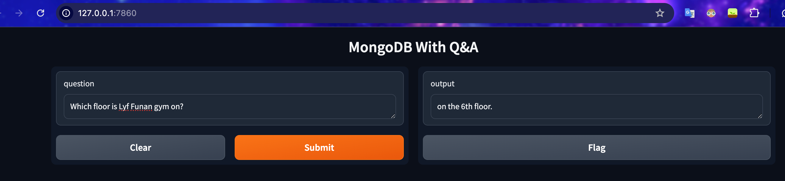

## hello-mongo

> docker-compose.yml 파일을 실행하고, `GET 127.0.0.1:7860`을 호출한 결과이다.

## Tech Stack
- FastAPI
- MongoDB
- Docker
- Gradio

> FastAPI는 스프링보다 lightweight한 비동기 API 서버로 쓰기 위한 것이다.
> MongoDB는 임베디드 벡터 데이터베이스로 사용할 예정이다.cache 용도로도 용이하다.

### Gradio Public interface
- https://c56e5e3c7e9415174f.gradio.live/